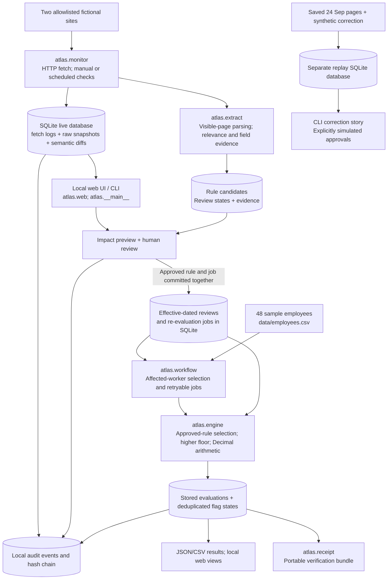

# Atlas architecture

Atlas is a local wage-compliance application built with Python, SQLite and a browser interface. It captures two wage sources, preserves their evidence, routes proposed changes through human review and evaluates employee wages against approved, effective rules.

## Components

The browser interface and CLI share the same storage and calculation logic. SQLite stores source snapshots, retrieval comparisons, rule candidates, review events, re-evaluation jobs and employee results. The calculation engine performs no network or model calls.

## Source checks and rule review

A manual check or scheduled poll retrieves both allowlisted sites. Atlas saves the HTML, retrieval time and content hash, then compares each retrieval with the previous one. The extractor classifies publications and preserves the evidence behind proposed amounts, scope and effective dates.

New candidates enter `REVIEW_REQUIRED` with a discovery timestamp. Numerical rules require an explicit `APPROVED` or `REJECTED` decision; supporting interpretations can be `ACKNOWLEDGED`. Daily federal/state rates are inspected together as one update, including when only one amount changes. Each jurisdiction retains its own rule version and evidence.

Approval and its re-evaluation job are written atomically. Future rules wait until their effective date. Corrections preserve earlier versions and identify the rule being superseded.

## Employee evaluation

The engine reads employee wages, work location and hours from the CSV. It selects the latest applicable approved version for each jurisdiction and applies the higher federal/state floor to Bellwether employees. Decimal arithmetic compares wages before rounding; equality passes.

Each result includes its decision, applicable rules, controlling version, source evidence, explanation and timestamp. Missing or uncertain required information produces `INSUFFICIENT_DATA` or `REVIEW_REQUIRED`. Salary estimates remain separate from actual hourly compliance wages.

## History and recovery

New approvals or effective dates trigger evaluation work for affected employees. Historical calculations use previously captured employee inputs. Jobs can be retried after a failure; repeated results reuse their identities while audit events preserve observation history.

Pending changes do not erase the last complete source-cleared results. The interface labels the saved date and current uncertainty. Exports and portable receipts retain the source and calculation evidence for each decision.

## Runtime and test boundaries

- The server binds to localhost and is intended for a single operator. Production authentication and full payroll integration are outside its scope.
- Website checks run manually or every 15 minutes while the selected server or foreground watcher is running. Automatic checks are off by default.
- Scenario lab stores custom-rate tests separately from live rules and approvals. The CLI correction test uses saved pages, an isolated database and explicitly simulated approvals.
- Failed fetches, unfamiliar page structures and conflicting source information remain visible and prevent unsupported current decisions.
- Local hash chains provide consistency checks; they are not external signatures. Receipt verification requires the matching engine and parser versions.

See [research](research.md) for source interpretation and assumptions, [validation](validation.md) for tested cases, and the [operator guide](operator-review.md) for the review workflow.
