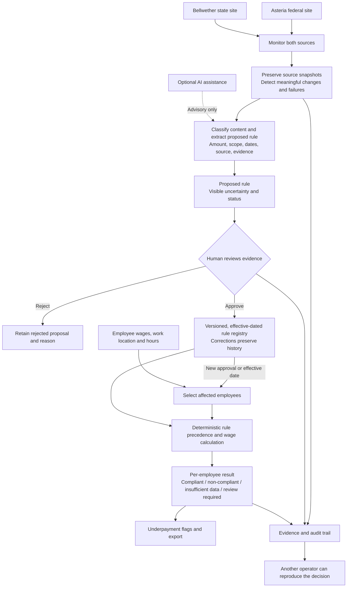
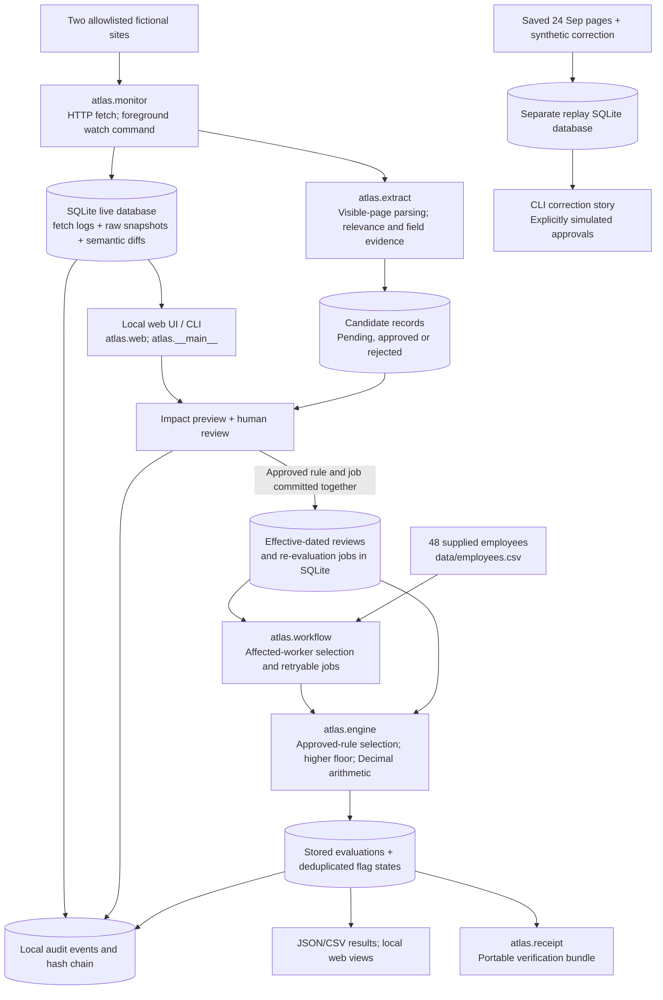

# Atlas architecture: assignment blueprint and implemented prototype

These diagrams separate **the system requested in the assessment** from **the local Atlas implementation**. Arrows show the flow of evidence and decisions, not a claim that every component needs its own service.

## 1. Blueprint requested by the assignment

The key gate is **human approval before a proposed publication becomes a controlling rule**. A page edit, future notice, proposal or ambiguous statement must not silently change an employee's compliance result. Bellwether employees may be subject to both federal and state rules; the higher approved applicable floor controls.

## 2. Architecture actually built in Atlas

**Live and test boundaries:** The web console captures the designated pages and leaves new rates pending until a person approves them. Scenario lab saves custom-rate calculation tests separately. The CLI correction story uses an isolated database, explicitly simulated approvals and a synthetic correction to test the complete change loop. It is not a second browser workspace.

**Implementation boundary:** `watch` is an optional foreground 15-minute process; the browser console can start the same interval while its server is open. Both schedules are stopped by default, and the earlier Codex freshness task was stopped at the candidate's request. Each completed watcher cycle archives all 48 results, including pending decisions. SQLite provides the local version, job and audit stores; there is no production identity system or full payroll integration. The wage calculation and final state always come from `atlas.engine`, not an LLM.
